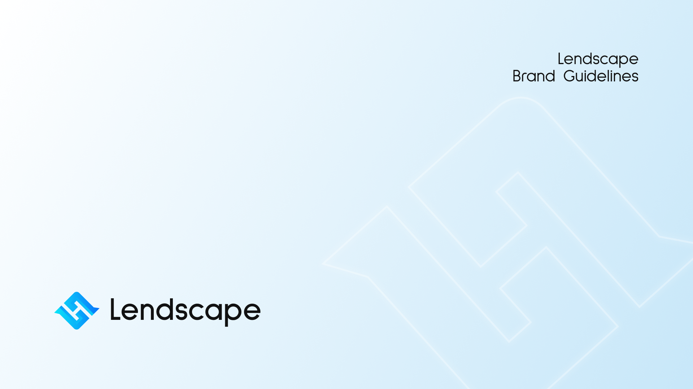
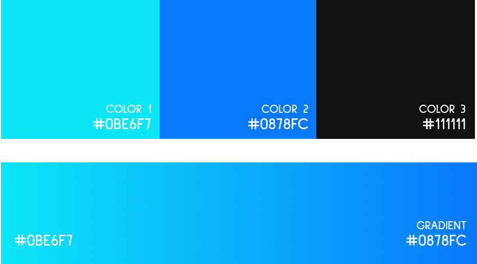
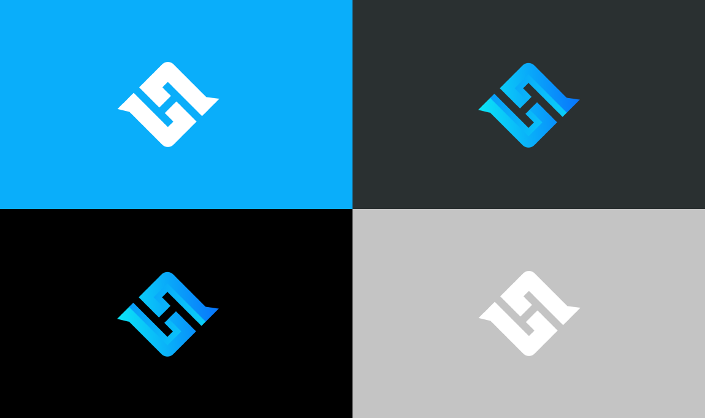

# Brand Guidelines 

This document contains a guide to using Lendscape identity system. Make sure to follow the rules to keep brand consistency.

It will cover all brand elements - logo, colors, typefaces and more - in order to keep consistency in all materials. You shall reference the document often to become an expert when it comes to using Lendscape identity elements.
## Correct use of our name
* Our project is called Lendscape which is one word and spelt with a capital L.
* Our token is $LSCP.
* Our community is called Lendscapers.
## Branding Guidelines
You may use the Lendscape name and logo in your website or app as long as you adhere to the Lendscape branding guidelines.
* Do not alter the Lendscape logo and the logo is intended to be used as provided.
* Do not combine the Lendscape logo with other images without consent.
* Do not use the Lendscape brand in any way that implies a relationship, affiliation, or endorsement. For example, "we partner with Lendscape." without consent.
* Do not use the Lendscape brand in conjunction with any illegal and unlawful activity, promotion, and product.
## Logo Varients
Lendscape provides logo varients in both `PNG` and `SVG` formats. The usage of the logo varients in `SVG` format is recommended for use in dapps, websites, graphics, showcase and other applications.

* `PNG:` [`/assets/logo/png`](./assets/logo/png)
* `SVG:` [`/assets/logo/svg`](./assets/logo/svg)

## Color Palette
Usage of our logo and other brand elements shall be consistent with the following color palette.

* Color 1: `#0BE6F7`
* Color 2: `#0878FC`
* Color 3: `#111111`
* Gradient: `#0BE6F7 - #0878FC`

## Typography
**Sulphur Point** is the primary type family of Landscape brand identity system. It's a Sans Serif typeface with a modern and minimal look. It's simple and easy to read. We use three different weights to create hierarchy and consistency in designs and documents.

You can find our typography `ttf` files in the [`/assets/font/`](./assets/font/) directory.
## Usage of backgrounds

